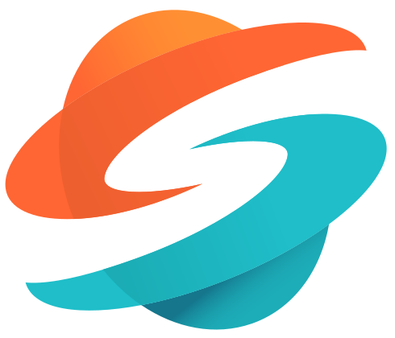

# Karel Tomanec

Graphics programmer with experience in real-time rendering and ray tracing, working on a Vulkan-based rendering engine for VR and automotive visualization. Background in GPU programming, physically based rendering, and ray tracing techniques.

### Toolchain

    
    
    
    
    
    
    
    

